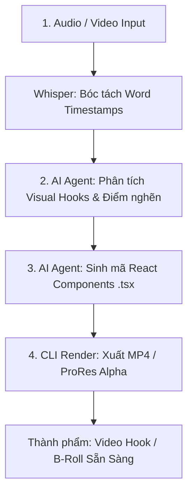

# 🚀 HƯỚNG DẪN TOÀN DIỆN VỀ REMOTION CHO HỆ THỐNG AUTO-EDIT & AI AGENT

> **Mục đích tài liệu:** Tài liệu này đóng gói toàn bộ logic hoạt động, cơ chế kỹ thuật, cấu trúc mã nguồn và quy trình cài đặt **Remotion** để một AI Agent (hoặc Developer) trên bất kỳ máy tính nào cũng có thể đọc hiểu và tích hợp ngay vào quy trình dựng video tự động (**Auto-Edit Pipeline**).

---

## 📑 MỤC LỤC
1. [Bản chất & Triết lý hoạt động của Remotion](#1-bản-chất--triết-lý-hoạt-động-của-remotion)
2. [Sự khác biệt giữa Remotion và Script JS/Canvas truyền thống](#2-sự-khác-biệt-giữa-remotion-và-script-jscanvas-truyền-thống)
3. [Kiến trúc & Các khái niệm cốt lõi (Core Concepts)](#3-kiến-trúc--các-khái-niệm-cốt-lõi-core-concepts)
4. [Quy trình tích hợp vào Pipeline Auto-Edit 4 Bước](#4-quy-trình-tích-hợp-vào-pipeline-auto-edit-4-bước)
5. [Hướng dẫn Cài đặt & Khởi tạo trên máy mới từ đầu](#5-hướng-dẫn-cài-đặt--khởi-tạo-trên-máy-mới-từ-đầu)
6. [Bộ khung Template Mã Nguồn chuẩn (Boilerplate Code)](#6-bộ-khung-template-mã-nguồn-chuẩn-boilerplate-code)
7. [Các lệnh CLI Render & Preview thiết yếu](#7-các-lệnh-cli-render--preview-thiết-yếu)
8. [Bộ Quy Tắc Vàng cho AI Agent khi viết Code Remotion](#8-bộ-quy-tắc-vàng-cho-ai-agent-khi-viết-code-remotion)

---

## 1. BẢN CHẤT & TRIẾT LÝ HOẠT ĐỘNG CỦA REMOTION

**Remotion** là một framework mã nguồn mở cho phép **lập trình video bằng React, TypeScript, HTML, CSS và Canvas/SVG**.

Thay vì dùng phần mềm đồ họa thủ công (After Effects, Premiere Pro, CapCut) kéo từng keyframe trên timeline:
* **Mỗi video là một React Component.**
* **Mỗi khung hình (frame) là một trạng thái (state) render xác định của DOM.**
* **Thời gian là hàm toán học của số thứ tự khung hình:**  
  $$\text{Visual State} = f(\text{currentFrame})$$

---

## 2. SỰ KHÁC BIỆT GIỮA REMOTION VÀ SCRIPT JS/CANVAS TRUYỀN THỐNG

Nhiều hệ thống auto-edit tự chế sử dụng JavaScript chạy trên trình duyệt rồi dùng Puppeteer quay màn hình (Screen Recording) hoặc ghi stream Canvas. Cách này gặp nhiều hạn chế so với Remotion:

```
[Phương pháp cũ: Real-time Screen Recording]
Trình duyệt chạy animation ➔ CPU lag 1 giây ➔ MẤT KHUNG HÌNH (Drop Frame) ➔ LỆCH TIẾNG!

[Remotion: Deterministic Frame-by-Frame]
Dừng ở Frame 0 ➔ Render ➔ Chụp ➔ Chuyển sang Frame 1 ➔ Render ➔ Chụp ➔ KHÔNG BAO GIỜ DROP FRAME!
```

### So sánh kỹ thuật:
1. **Tính tất định (Determinism):** Remotion render frame-by-frame rời rạc. Dù máy tính yếu render mất 10 phút, video xuất ra vẫn chuẩn xác 100% từng mili-giây, khớp tuyệt đối với âm thanh gốc.
2. **Khả năng tua timeline (Scrubbing Preview):** Remotion Studio cung cấp Player chuyên nghiệp, cho phép tua tới/lui bất kỳ frame nào để kiểm tra ngay lập tức.
3. **Hệ sinh thái React:** Tận dụng trực tiếp `lucide-react`, TailwindCSS, Three.js, Recharts, Lottie mà không cần tự build pipeline phức tạp.

---

## 3. KIẾN TRÚC & CÁC KHÁI NIỆM CỐT LÕI (CORE CONCEPTS)

### A. Trái tim của chuyển động: `useCurrentFrame()` và `useVideoConfig()`
Mọi animation trong Remotion đều xoay quanh hook `useCurrentFrame()`. Hook này trả về số thứ tự của frame hiện tại (0, 1, 2, ..., $N$).

```tsx
import { useCurrentFrame, useVideoConfig } from "remotion";

const MyAnimation = () => {
  const frame = useCurrentFrame(); // Frame hiện tại (vd: 45)
  const { fps, width, height, durationInFrames } = useVideoConfig();
  
  return <div style={{ opacity: frame / 30 }}>Xin chào!</div>;
};
```

---

### B. Hàm nội suy toán học: `interpolate()`
Dùng để biến đổi tuyến tính giá trị từ khoảng frame này sang giá trị hiển thị (opacity, scale, vị trí x/y, góc xoay).

```tsx
import { interpolate } from "remotion";

// Khi frame từ 0 -> 15: opacity tăng từ 0 -> 1
// Khi frame từ 140 -> 156: opacity giảm từ 1 -> 0
const opacity = interpolate(
  frame,
  [0, 15, 140, 156],
  [0, 1, 1, 0],
  { extrapolateLeft: "clamp", extrapolateRight: "clamp" }
);
```

---

### C. Chuyển động vật lý mượt mà: `spring()`
Thay vì các đường cong easing thô cứng, hàm `spring()` tạo ra độ nảy (bounce/damping) tự nhiên như ứng dụng iOS cao cấp.

```tsx
import { spring, useCurrentFrame, useVideoConfig } from "remotion";

const frame = useCurrentFrame();
const { fps } = useVideoConfig();

const cardScale = spring({
  frame,
  fps,
  config: {
    damping: 14,   // Độ hãm (càng cao càng ít nảy)
    mass: 0.6,      // Khối lượng vật thể
    stiffness: 120, // Độ cứng lò xo (càng cao phản hồi càng nhanh)
  },
});

return <div style={{ transform: `scale(${cardScale})` }}>Dynamic Card</div>;
```

---

### D. Cấu trúc Phân tầng Video (Layering Strategy)
Để ghép Motion Graphics đè lên video người nói:

```tsx
<AbsoluteFill>
  {/* Lớp 1: Video người nói gốc */}
  <Video src={staticFile("footage.mp4")} />

  {/* Lớp 2: Vignette làm tối nền nhẹ để nổi bật chữ */}
  <AbsoluteFill style={{ background: "rgba(0,0,0,0.3)" }} />

  {/* Lớp 3: Các phân cảnh Motion Graphic (Scene 1, 2, 3) */}
  <Scene1 />
  <Scene2 />
  <Scene3 />

  {/* Lớp 4: Kinetic Subtitles */}
  <Captions />
</AbsoluteFill>
```

---

## 4. QUY TRÌNH TÍCH HỢP VÀO PIPELINE AUTO-EDIT 4 BƯỚC



### Bước 1: Bóc tách mốc thời gian giọng nói (Speech-to-Text)
Sử dụng `faster-whisper` hoặc OpenAI Whisper để xuất danh sách câu kèm `start` và `end` theo giây.
* Công thức đổi sang frame:
  $$\text{startFrame} = \text{Math.round}(\text{startSeconds} \times \text{FPS})$$
  $$\text{endFrame} = \text{Math.round}(\text{endSeconds} \times \text{FPS})$$

### Bước 2: AI xác định loại Visual Hook phù hợp
* **Phát hiện vấn đề / nỗi đau (Problem):** Sinh biểu đồ giảm sút (Drop chart), cảnh báo đỏ, chỉ số 0 đơn hàng.
* **Phát hiện giải pháp / cơ chế (Mechanism):** Sinh Pipeline quy trình 3 bước (Framework step-by-step), mở khóa biểu tượng `Unlock`.
* **Phát hiện sự kiện / kêu gọi (CTA / Event):** Sinh thẻ VIP Ticket, ngày tháng tổ chức kèm hiệu ứng phát xung ánh sáng (Pulse).

### Bước 3: AI lập trình Component Remotion
AI Agent viết trực tiếp các file `.tsx` vào thư mục `src/components/`.

### Bước 4: Thực thi lệnh Render tự động
Hệ thống gọi lệnh CLI render ra file `.mp4` hoặc `.mov` (nền trong suốt) để ghép vào timeline.

---

## 5. HƯỚNG DẪN CÀI ĐẶT & KHỞI TẠO TRÊN MÁY MỚI TỪ ĐẦU

### Điều kiện tiên quyết:
* **Node.js**: Phiên bản 18+ hoặc 20+ trở lên.
* **FFmpeg**: Có sẵn trên máy (hoặc Remotion sẽ tự động tải phiên bản tương thích).

### Lệnh tạo dự án Remotion nhanh (Non-interactive):
```powershell
# 1. Tạo project blank không cần tương tác dòng lệnh
npx -y create-video@latest --yes --blank remotion_studio --no-tailwind

# 2. Di chuyển vào thư mục dự án
cd remotion_studio

# 3. Cài đặt các thư viện bổ trợ thiết yếu
npm install lucide-react clsx
```

### Cấu trúc thư mục khuyến nghị:
```
remotion_studio/
├── public/
│   └── footage.mp4             # Video gốc hoặc tài nguyên ảnh/âm thanh
├── src/
│   ├── components/
│   │   ├── Scene1_ZeroSales.tsx        # Đồ họa phân cảnh 1
│   │   ├── Scene2_MissingStructure.tsx # Đồ họa phân cảnh 2
│   │   ├── Scene3_WorkshopEvent.tsx    # Đồ họa phân cảnh 3
│   │   └── Captions.tsx                # Phụ đề động
│   ├── Composition.tsx         # Ghép nối các lớp đồ họa
│   ├── Root.tsx                # Đăng ký các Composition
│   ├── types.ts                # Khai báo cấu hình kích thước & FPS
│   ├── index.css               # Font chữ và global styles
│   └── index.ts                # Entrypoint của Remotion
├── package.json
└── remotion.config.ts
```

---

## 6. BỘ KHUNG TEMPLATE MÃ NGUỒN CHUẨN (BOILERPLATE CODE)

### 📄 `src/types.ts`
```typescript
export interface VideoConfig {
  fps: number;
  width: number;
  height: number;
  durationInFrames: number;
}

export const VIDEO_CONFIG: VideoConfig = {
  fps: 30,
  width: 1080,
  height: 1920, // 9:16 khung hình dọc (Shorts/Reels/TikTok)
  durationInFrames: 450, // 15 giây * 30 fps
};
```

---

### 📄 `src/Composition.tsx`
```tsx
import React from "react";
import { AbsoluteFill, staticFile, Video } from "remotion";
import { Scene1_ZeroSales } from "./components/Scene1_ZeroSales";
import { Scene2_MissingStructure } from "./components/Scene2_MissingStructure";
import { Scene3_WorkshopEvent } from "./components/Scene3_WorkshopEvent";
import { Captions } from "./components/Captions";

// 1. Layer đồ họa trong suốt (để xuất B-Roll riêng)
export const MotionGraphicsOverlay: React.FC = () => {
  return (
    <AbsoluteFill>
      <Scene1_ZeroSales />
      <Scene2_MissingStructure />
      <Scene3_WorkshopEvent />
      <Captions />
    </AbsoluteFill>
  );
};

// 2. Video hoàn chỉnh (ghép sẵn cả footage nền)
export const FullVideoComposition: React.FC = () => {
  return (
    <AbsoluteFill style={{ backgroundColor: "#020617" }}>
      <Video
        src={staticFile("footage.mp4")}
        style={{ width: "100%", height: "100%", objectFit: "cover" }}
      />
      <AbsoluteFill
        style={{
          background: "linear-gradient(180deg, rgba(0,0,0,0.4) 0%, rgba(0,0,0,0.1) 40%, rgba(0,0,0,0.6) 100%)",
          pointerEvents: "none",
        }}
      />
      <MotionGraphicsOverlay />
    </AbsoluteFill>
  );
};
```

---

### 📄 `src/Root.tsx`
```tsx
import React from "react";
import { Composition } from "remotion";
import "./index.css";
import { FullVideoComposition, MotionGraphicsOverlay } from "./Composition";
import { VIDEO_CONFIG } from "./types";

export const RemotionRoot: React.FC = () => {
  return (
    <>
      {/* Composition xuất video hoàn chỉnh */}
      <Composition
        id="FullVideoWithBroll"
        component={FullVideoComposition}
        durationInFrames={VIDEO_CONFIG.durationInFrames}
        fps={VIDEO_CONFIG.fps}
        width={VIDEO_CONFIG.width}
        height={VIDEO_CONFIG.height}
      />

      {/* Composition xuất lớp Overlay trong suốt */}
      <Composition
        id="MotionGraphicsOverlayOnly"
        component={MotionGraphicsOverlay}
        durationInFrames={VIDEO_CONFIG.durationInFrames}
        fps={VIDEO_CONFIG.fps}
        width={VIDEO_CONFIG.width}
        height={VIDEO_CONFIG.height}
      />
    </>
  );
};
```

---

## 7. CÁC LỆNH CLI RENDER & PREVIEW THIẾT YẾU

### 1. Xem trước thời gian thực (Live Preview):
```powershell
npx remotion preview
# hoặc: npm run dev
```
👉 Mở `http://localhost:3000` trên trình duyệt để tua timeline và xem hoạt ảnh.

---

### 2. Xuất video MP4 hoàn chỉnh (Đa luồng):
```powershell
npx remotion render FullVideoWithBroll out/final_video.mp4 --concurrency=4
```

---

### 3. Xuất video nền trong suốt (Alpha Channel) để kéo vào Premiere/CapCut/DaVinci:
```powershell
# Xuất định dạng ProRes 4444 hỗ trợ Alpha:
npx remotion render MotionGraphicsOverlayOnly out/overlay.mov --codec=prores --prores-profile=4444

# Hoặc xuất WebM trong suốt:
npx remotion render MotionGraphicsOverlayOnly out/overlay.webm --codec=vp9
```

---

### 4. Xuất 1 frame ảnh tĩnh để kiểm tra (Testing):
```powershell
npx remotion still FullVideoWithBroll out/preview_frame.png --frame=75
```

---

## 8. BỘ QUY TẮC VÀNG CHO AI AGENT KHI VIẾT CODE REMOTION

1. **Luôn chặn biên `interpolate`:**  
   Bắt buộc thêm `{ extrapolateLeft: "clamp", extrapolateRight: "clamp" }` để tránh trường hợp vượt quá mốc frame bị biến dạng giao diện ngoài mong muốn.
2. **Ẩn component khi ngoài phạm vi thời gian:**  
   Nếu phân cảnh chỉ xuất hiện từ frame 0 đến 156:
   ```tsx
   if (frame < 0 || frame > 156) return null;
   ```
   Việc này giúp giải phóng DOM và tăng tốc độ render lên gấp 3 lần.
3. **Sử dụng `spring` cho mọi chuyển động xuất hiện (Entrance):**  
   Chuyển động tự nhiên nhất là đặt `damping: 12-14`, `mass: 0.5-0.7`, `stiffness: 100-120`.
4. **Thiết kế phong cách Dark Tech / Modern Glassmorphism:**  
   * Nền card: `rgba(15, 23, 42, 0.9)` kết hợp `backdrop-filter: blur(20px)`.
   * Viền card: `1px solid rgba(255, 255, 255, 0.12)`.
   * Đổ bóng: `box-shadow: 0 20px 50px rgba(0,0,0,0.7)`.
   * Badge nổi bật: Gradient viền màu Cyan (`#38bdf8`), Gold (`#f59e0b`) hoặc Red Alert (`#ef4444`).
5. **Đảm bảo tính độc lập:**  
   Mỗi Scene nên là một file riêng biệt trong `src/components/`, không phụ thuộc trạng thái toàn cục để AI có thể tự sinh lại bất kỳ phân cảnh nào khi người dùng muốn sửa đổi.

---
*Tài liệu được biên soạn tự động bởi Antigravity Engine.*
